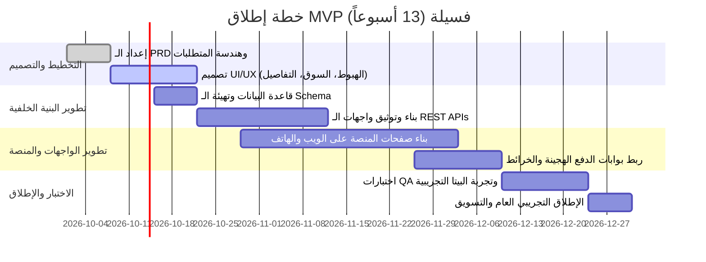

# خطة المهام التنفيذية والجدول الزمني (13 أسبوعاً) — مشروع فسيلة

## 1. الجدول الزمني لتنفيذ الـ MVP (Roadmap)

### تفصيل المراحل الأسبوعية:
- **الأسابيع 1–2 (التخطيط والتصميم):**
  - استكمال وثيقة PRD النهائية وتحديد مسارات المستخدم (User Flows).
  - تصميم واجهات المستخدم عالية الدقة (Figma) لكافة الشاشات (Landing, Marketplace, Tree Details, Dashboard, Farmer Portal).
  - توقيع أول 3 عقود تجريبية مع مزارعين في طرطوس وإدلب.

- **الأسابيع 3–6 (تطوير Backend وقواعد البيانات):**
  - إعداد بيئة الخادم وقاعدة البيانات مع تطبيق مخطط الكيانات (Entities).
  - تطوير وتأمين واجهات الـ APIs لجميع العمليات.
  - إعداد خدمة تخزين الوسائط (S3 Compatible / Cloud Storage).

- **الأسابيع 4–9 (تطوير الواجهة الأمامية Frontend):**
  - بناء المكونات التفاعلية بتصميم عصري داعم للعربية (RTL) متوافق تماماً مع الهواتف الذكية.
  - دمج الخرائط التفاعلية ومعارض الصور الزمنية (Timelines).
  - بناء بوابة المزارع البسيطة لرفع التحديثات بنقرة زر واحدة.

- **الأسابيع 8–10 (التكاملات والدفع):**
  - تفعيل بوابة الدفع الدولي (البطاقات) للمغتربين.
  - بناء مسار الحوالات المحلية ورفع إشعار الدفع واعتماده يدوياً.
  - ربط خدمة الإشعارات التلقائية (Web Push / SMS).

- **الأسابيع 10–12 (الجودة والتجربة المغلقة):**
  - اختبارات فحص الجودة (QA) على مختلف أنواع الأجهزة والمتصفحات.
  - إطلاق نسخة تجريبية مغلقة (Private Beta) مع 50-100 مستخدم حقيقي.
  - إصلاح الأخطاء وتحسين تجربة الشراء وسرعة تحميل الصور.

- **الأسبوع 13 (الإطلاق الرسمي والمراقبة):**
  - فتح التسجيل العام وبدء الحملة التسويقية الرقمية.
  - مراقبة مؤشرات الأداء والأمان (APM & Crash Reporting).

---

## 2. فريق العمل وتوزيع المسؤوليات

| الدور | المهام والمسؤوليات |
|---|---|
| **مدير المشروع (PM)** | إدارة الجدول الزمني، التنسيق بين الفريق، ومتابعة التواصل مع المزارعين والشركاء |
| **مصمم واجهات (UI/UX)** | تصميم تجربة مستخدم سلسة، إنتاج مكونات التصميم وتطوير الهوية البصرية |
| **مطور واجهات أمامية (Frontend)** | بناء صفحات وتطبيق الويب، تحسين سرعة الأداء، وضمان تجاوب الهواتف |
| **مطور بنية خلفية (Backend)** | بناء واجهات برمجة التطبيقات، إدارة الأمان والتحقق، وهيكلة قواعد البيانات |
| **مهندس DevOps** | إعداد السيرفرات، إدارة النطاقات، النسخ الاحتياطي التلقائي، وشهادات الأمان SSL |
| **مسؤول الشراكات الميدانية** | زيارة المزارع، توثيق الأشجار وإحداثياتها، وتدريب المزارعين على التوثيق |
| **خدمة العملاء والدعم الفني** | متابعة استفسارات المستثمرين، تأكيد الحوالات المحلية، ومتابعة شحن الزيت |

---

## 3. الميزانية التقديرية للمرحلة التأسيسية (MVP)

- **تكاليف التصميم والتطوير البرمجي:** 20,000$ – 45,000$ (بحسب حجم الفريق والتعاقد).
- **التشغيل والاستضافة السنوية:** 8,000$ – 15,000$ (سيرفرات سحابية، تخزين الصور، خدمة SMS، ونطاقات).
- **ميزانية التسويق والإطلاق:** 3,000$ – 10,000$ (إعلانات رقمية موجهة للمغتربين، محتوى فيديو، وإنتاج قصص المزارعين).
- **النفقات الميدانية والقانونية:** 2,000$ – 5,000$ (توثيق العقود، فحوصات مخبرية لعينات الزيت، ووسائل تغليف معتمدة).

---

## 4. قائمة فحص الجودة والإطلاق (QA Checklist)
- [ ] التأكد من عمل تسجيل الدخول واستلام رمز التحقق OTP بنجاح.
- [ ] تجربة شراء حصة وتسجيل الحركة المالية في جدول Transactions.
- [ ] اختبار رفع إيصال الدفع المحلي والتأكد من إمكانية مراجعته واعتماده من لوحة الإدارة.
- [ ] التحقق من دقة إحداثيات GPS على الخريطة وسرعة تحميل صور الأشجار والمعرض الزمني.
- [ ] تجربة بوابة المزارع من هاتف محمول والتأكد من سهولة رفع صورة جديدة وسجل صيانة.
- [ ] التحقق من اتجاه النصوص وملاءمة خطوط الواجهة العربية (RTL) دون أي تشوهات بصرية.
- [ ] نشر سياسة الخصوصية وشروط الاستخدام وتوضيح سياسة تسوية القوة القاهرة.
